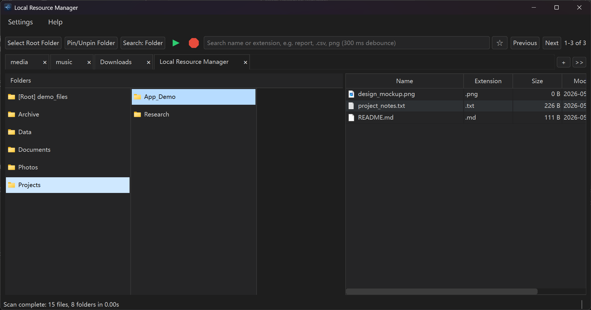

# Local Resource Manager

A desktop file explorer for **ultrafast** local search and multi-column folder navigation. Scan a folder, search by name or extension, and jump back to saved locations with bookmark tabs — all on your machine, no account required.

Built with Python and PySide6. Early public release; source builds are available now; Windows `.exe` releases are planned.

## Highlights

- **Ultrafast local search** — SQLite-backed index; search by file name or extension
- **Multi-column navigation** — move through nested folders column by column; folders left, files right
- **Keyboard mode** — W/A/S/D for fast folder and file-list navigation
- **Pin folder / scoped search** — lock browsing and search to a chosen subtree; toggle current-folder vs subtree search
- **Bookmark tabs** — save folder + search queries; update, close, and reopen from the tab bar

## Screenshots



## Core features

### Fast local search

Scan a root folder into a local SQLite index. Results are paginated for large libraries.

### Multi-column navigation

Drill across folder levels without losing context. Jump back to the root or move between levels without clearing your search.

### Scoped search and pin folder

Search the current folder or its full subtree. **Pin** a folder to keep navigation and search inside that area without changing the root index.

### Bookmarks and customization

Bookmark tabs for repeat workflows. Themes, custom colors, optional icons, rebindable shortcuts, and search settings are available in Settings.

## Also includes

Cancellable scans · per-root databases · optional file watching and folder match counts

## Privacy

Everything runs locally. No files are uploaded to a server.

- **Windows `.exe`:** `%LOCALAPPDATA%\Local Resource Manager\` (`data\`, `config\`)
- **Run from source:** `app/data/` and `app/config/` next to the project

## Requirements

- **Windows `.exe`:** Windows 10/11 (64-bit); no Python install required
- **From source:** Python 3.10+
- macOS / Linux: source only for now; packaged builds not finalized

## Windows (executable)

Download **`Local Resource Manager.exe`** from [Releases](https://github.com/xintian-lab/local-resource-manager/releases) (or build locally — see below). Double-click to run. Settings and indexes are stored under `%LOCALAPPDATA%\Local Resource Manager\`.

Note: The Windows build may show a security warning because it is not code-signed yet.

**Build locally (Windows):**

```powershell
.\build_exe.ps1
```

Output: `dist\Local Resource Manager.exe`

## Run from source

**Windows:**

```bash
git clone https://github.com/xintian-lab/local-resource-manager.git
cd local-resource-manager
python -m venv .venv
.venv\Scripts\activate
python -m pip install --upgrade pip
pip install -r requirements.txt
python main.py
```

**macOS / Linux:** use `python3`, then `source .venv/bin/activate` instead of `.venv\Scripts\activate`.

## Developer notes

| Item | Source run | Windows `.exe` |
| --- | --- | --- |
| Settings | `app/config/settings.json` | `%LOCALAPPDATA%\Local Resource Manager\config\settings.json` |
| Bookmark tabs | `app/config/bookmarks.json` | `%LOCALAPPDATA%\Local Resource Manager\config\bookmarks.json` |
| Index database | `app/data/file_index*.db` | `%LOCALAPPDATA%\Local Resource Manager\data\file_index*.db` |

Entry: `main.py` · UI: `app/ui/` · Core: `app/core/` · Build: [`build_exe.ps1`](build_exe.ps1) · Dependencies: [`requirements.txt`](requirements.txt)

## Roadmap

Windows installer · macOS `.app` · improved release packaging · more UI layout options

## License

[MIT License](LICENSE) — free to use, modify, and distribute with attribution.
